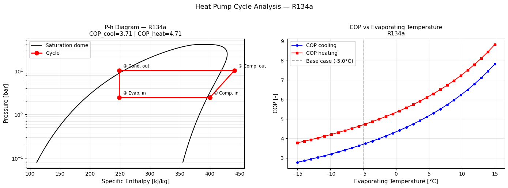
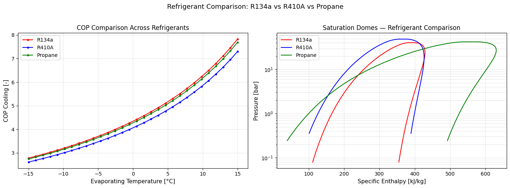

# Heat Pump Cycle Simulator

A Python-based simulation tool for vapour compression heat pump cycles,
using real refrigerant properties via the CoolProp library.

## What This Project Does

- Models all 4 thermodynamic state points of a vapour compression cycle
  (compressor, condenser, expansion valve, evaporator)
- Calculates COP for both cooling and heating modes
- Accounts for real compressor isentropic efficiency
- Performs parametric analysis of COP vs evaporating temperature
- Compares performance across three refrigerants: R134a, R410A, and Propane

## Results

### P-h Diagram with Cycle — R134a

### Refrigerant Comparison

**Base case results (R134a, T_evap = -5°C, T_cond = 40°C):**
- COP cooling: 3.71
- COP heating: 4.71
- Evaporating pressure: ~2.96 bar
- Condensing pressure: ~10.17 bar

## Key Findings

- COP increases significantly with rising evaporating temperature due to
  reduced compressor pressure ratio
- R134a and Propane (R290) achieve comparable COP performance
- R410A operates at higher pressures, requiring more robust system components
- Propane is an environmentally attractive alternative (low GWP) with
  excellent thermodynamic properties

## How to Run

Open the notebook directly in Google Colab:

1. Download `heat_pump_simulator.ipynb`
2. Go to colab.research.google.com
3. File → Upload notebook
4. Run all cells (the notebook installs CoolProp automatically)

## Libraries Used

- [CoolProp](http://www.coolprop.org/) — thermodynamic properties
- NumPy — numerical calculations
- Matplotlib — plotting

## Background

Vapour compression cycles are the foundation of heat pumps, refrigerators,
and air conditioning systems. This tool was built to explore how operating
conditions and refrigerant choice affect system performance — directly
relevant to heat pump integration in modern energy systems and district
heating networks.
